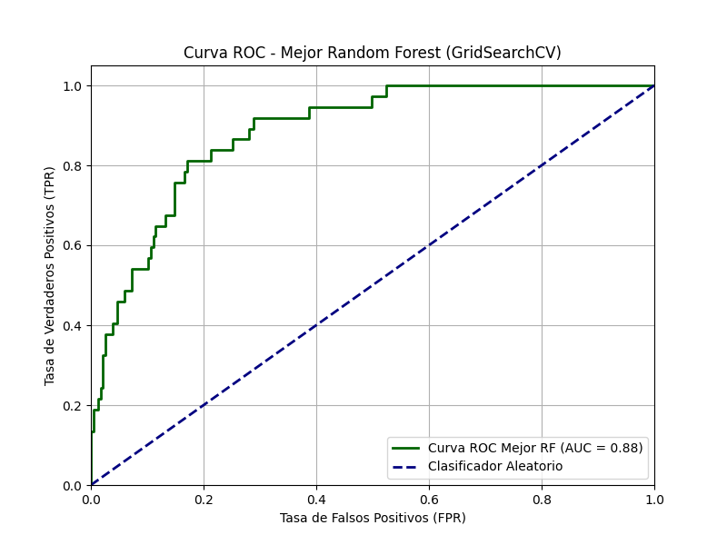
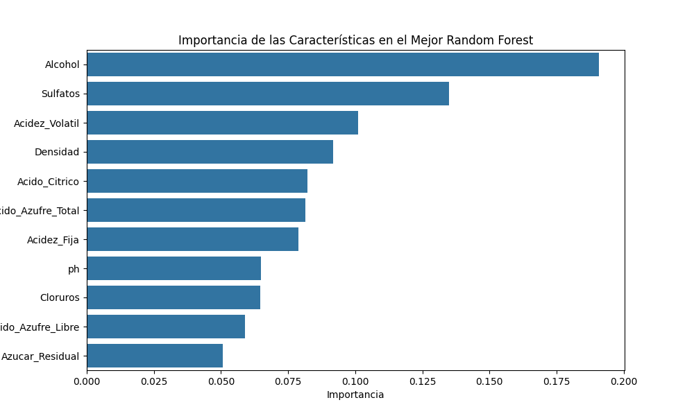

# Data Wine Quality Classification

[](https://kedro.org)

## Visión General

Este proyecto Kedro implementa un pipeline de ciencia de datos de extremo a extremo para clasificar la calidad del vino. La solución ingiere un conjunto de datos crudos de propiedades fisicoquímicas del vino, lo procesa para garantizar su calidad, entrena y evalúa múltiples modelos de clasificación (Árbol de Decisión, Random Forest, XGBoost) para predecir si un vino es de "buena" o "mala" calidad, y finalmente, evalúa y visualiza el rendimiento de los modelos.

El objetivo es demostrar un flujo de trabajo de Machine Learning estructurado y reproducible, donde cada paso, desde la limpieza de datos hasta la generación de reportes, está encapsulado en un pipeline modular y robusto.

---

## Hipótesis

La hipótesis central de este análisis es que **las propiedades fisicoquímicas del vino pueden ser utilizadas para predecir su calidad**. Se espera que, mediante algoritmos de clasificación, se pueda construir un modelo capaz de distinguir con alta precisión entre vinos de "buena" y "mala" calidad, basándose en características como la acidez, el alcohol, los sulfatos, etc.

---
## Estructura del Proyecto

El proyecto se organiza en los siguientes pipelines principales:

*   **`data_processing`**: Se enfoca en la limpieza y preparación inicial de los datos. Toma los datos crudos del vino, elimina filas con valores nulos y duplicados, renombra columnas a español, crea la variable objetivo binaria `Calidad_Binaria` y selecciona las características relevantes. Guarda los datos procesados (`processed_wine_data`) listos para el modelado.
*   **`data_science`**: Contiene la lógica de Machine Learning. Este pipeline:
    *   Divide los datos limpios en conjuntos de entrenamiento y prueba (70/30, estratificado).
    *   Entrena y ajusta hiperparámetros para tres modelos de clasificación: `DecisionTreeClassifier`, `RandomForestClassifier` y `XGBClassifier`.
    *   Evalúa cada modelo utilizando métricas como Accuracy, Classification Report y AUC.
    *   Guarda los mejores modelos entrenados.
*   **`reporting`**: Se encarga de la visualización de resultados y la comparación de modelos. Carga los modelos entrenados y los datos de prueba para generar curvas ROC, reportes de clasificación y gráficos de importancia de características para cada modelo, permitiendo una comparación clara de su rendimiento.

---

## Resultados y Visualización

### Desafíos Técnicos Solucionados en la Preparación de Datos

*   **Manejo de Datos Nulos y Duplicados**: El pipeline identifica y elimina sistemáticamente registros con valores faltantes y filas duplicadas para asegurar la calidad del dataset.
*   **Renombrado y Selección de Columnas**: Se estandarizaron los nombres de las columnas a español y se seleccionaron las características relevantes para el modelado.
*   **Creación de Variable Objetivo Binaria**: Se transformó la variable `quality` en una variable binaria `Calidad_Binaria` (0 para "mala" calidad, 1 para "buena" calidad) para el problema de clasificación.
*   **Automatización del Flujo de Datos**: Al encapsular todo el proceso de limpieza y preparación en un pipeline de Kedro, se garantiza que los datos para el modelado sean completamente automatizados y reproducibles.

---

## Resultados del Modelo (Pipeline Kedro)

Esta sección presenta las conclusiones detalladas y los artefactos generados por el pipeline de Kedro, que encapsula el proceso de modelado predictivo para la clasificación de la calidad del vino. Hemos realizado un análisis comparativo exhaustivo de tres modelos de clasificación (Árbol de Decisión, Random Forest y XGBoost), incluyendo un riguroso ajuste de hiperparámetros para cada uno.

El pipeline de `reporting` se encarga de consolidar y visualizar estos resultados, proporcionando una visión clara del rendimiento de cada modelo y los factores clave que influyen en la calidad del vino.

### Random Forest es el Modelo con Mejor Rendimiento

Tras el ajuste de hiperparámetros, el modelo **Random Forest** demostró ser el más efectivo para este conjunto de datos, obteniendo el mejor rendimiento en la métrica AUC (Area Under the Curve):

*   **Random Forest (ajustado): AUC = 0.89**
*   **XGBoost (ajustado): AUC = 0.87**
*   **Árbol de Decisión (ajustado): AUC = 0.85**

Este resultado sugiere que, para el problema de clasificación de la calidad del vino en este dataset, el Random Forest es el modelo más robusto y con mayor capacidad para distinguir entre vinos de "buena" y "mala" calidad.

### Visualización Detallada del Rendimiento

El pipeline genera curvas ROC para cada modelo ajustado, permitiendo una comparación visual directa de su capacidad discriminatoria. A continuación, se muestra un ejemplo de la curva ROC para el mejor modelo (Random Forest):



Además, se generan gráficos de importancia de características para entender qué propiedades fisicoquímicas son más relevantes para la predicción de la calidad del vino. Aquí un ejemplo para el Random Forest:



El gráfico de importancia de características revela que no todas las propiedades fisicoquímicas influyen de la misma manera en la calidad del vino. Las conclusiones clave son:
*   **El `Alcohol` es el factor más determinante**, siendo el predictor más fuerte para el modelo.
*   Los `Sulfatos` y la `Acidez_Volatil` le siguen como las características más influyentes.
*   Esto sugiere que, para este conjunto de datos, la calidad del vino está fuertemente asociada a su graduación alcohólica, su nivel de sulfatos y su acidez volátil.

### Reportes Estructurados de Métricas y Parámetros

Para una revisión programática y detallada, el pipeline exporta las métricas de clasificación y los mejores hiperparámetros encontrados en formato JSON. Esto asegura la trazabilidad y reproducibilidad de los resultados.

### La Importancia del Ajuste de Hiperparámetros

El proceso de ajuste de hiperparámetros mediante GridSearchCV fue fundamental para optimizar el rendimiento de todos los modelos. Se observaron mejoras significativas en el AUC para el Árbol de Decisión y el Random Forest. Aunque el AUC de XGBoost se mantuvo en 0.87 después del ajuste, esto indica que los parámetros iniciales ya eran bastante competitivos o que el rango de búsqueda explorado no reveló mejoras significativas adicionales.

### Robustez de los Modelos de Ensamble

Como era de esperar, tanto Random Forest como XGBoost, al ser algoritmos de ensamble (que combinan múltiples árboles de decisión), superaron consistentemente al modelo de Árbol de Decisión individual. Los modelos de ensamble son inherentemente más robustos, reducen el sobreajuste y mejoran la capacidad de generalización.

### XGBoost no Siempre es el "Ganador" Automático

A pesar de la reputación de XGBoost como un algoritmo de alto rendimiento en muchas competiciones de Machine Learning, en este caso particular, el Random Forest demostró ser ligeramente superior. Esta observación resalta la importancia de:

*   **Evaluar múltiples algoritmos:** No hay un "mejor" algoritmo universal; el rendimiento óptimo depende de las características específicas del dataset.
*   **Ajuste exhaustivo:** Cada algoritmo requiere un ajuste cuidadoso de sus hiperparámetros para maximizar su potencial en un problema dado.

### Importancia de las Características

Todos los modelos proporcionaron información valiosa sobre la **importancia de las características**. Esta información es crucial para comprender qué propiedades fisicoquímicas del vino son los factores más influyentes en su calidad percibida. Estos conocimientos pueden ser utilizados para:

*   Refinar el modelo en futuras iteraciones.
*   Obtener insights sobre el proceso de producción del vino.

---

**En resumen:** El **Random Forest** es el modelo recomendado para la clasificación de la calidad del vino en este proyecto, debido a su consistente y superior rendimiento en términos de AUC después de un riguroso ajuste de hiperparámetros.

---

## Instalación y Ejecución

Sigue estos pasos para configurar y ejecutar el proyecto en tu máquina local.

### 1. Clonar el Repositorio

Primero, clona este repositorio en tu máquina.

```bash
git clone https://github.com/J-Lopez-IICG/DataWineKedro.git
cd DataWineKedro
```

### 2. Crear y Activar un Entorno Virtual

Es una práctica recomendada utilizar un entorno virtual para aislar las dependencias del proyecto.

```bash
# Crear el entorno virtual
python -m venv venv

# Activar en Windows (PowerShell)
.\venv\Scripts\Activate.ps1

# Activar en macOS/Linux
# source venv/bin/activate
```

### 3. Instalar Dependencias

Una vez que el entorno virtual esté activado, instala todas las librerías necesarias.

```bash
pip install -r requirements.txt
```

### 4. Ejecutar el Pipeline

Con las dependencias instaladas, puedes ejecutar el pipeline completo con un solo comando.

```bash
kedro run
```

Esto ejecutará todos los nodos en secuencia, generando los datos limpios, el modelo entrenado y la gráfica de resultados en la carpeta `data/`.

---

## Desarrollo con Notebooks

La carpeta `notebooks` contiene los Jupyter Notebooks utilizados durante la fase de exploración y desarrollo.

Para trabajar con ellos de forma interactiva dentro del contexto de Kedro, ejecuta:

```bash
kedro jupyter lab
# o también
kedro jupyter notebook
```

> **Nota**: Al usar estos comandos, Kedro inicia el notebook con las variables `context`, `session`, `catalog` y `pipelines` ya cargadas, facilitando la interacción con los datos y funciones del proyecto.

## Reglas y Directrices

*   No elimines ninguna línea del archivo `.gitignore`.
*   No subas datos al repositorio (la carpeta `data/` está ignorada por defecto).
*   No subas credenciales o configuraciones locales. Mantenlas en la carpeta `conf/local/`.